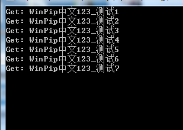

### 进程间通信（IPC，InterProcess Communication）

#### 例子一：WinPipeWapper

移除第三方头文件依赖，使用std::string作为消息容器。

封装为一个类，使用简单，适用于小项目。

```cpp
void th_pipeWrite()
{
	Pipe pipe;
	pipe.CreatePipe("test_pipe");
	int nCount = 1;
	char szNum[10] = { 0 };
	do 
	{
		itoa(nCount, szNum, 10);
		nCount++;
		std::string strMsg = "WinPip中文123_测试";
		strMsg.append(szNum);
		pipe.PipeSendMessage(strMsg);
		// 写的时间间要大于读的时间间隔
		Sleep(500);
	} while (!g_bExit);
}
```


#### demo

<p align="center">

</p>

---

#### 例子二：FastIPC

代码从[DarkoreXOR](https://github.com/DarkoreXOR)的[hooklib](https://github.com/DarkoreXOR/hooklib)项目中提取的。

#### 说明
FastIpc使用管道来实现通信，支持多线程。

测试demo：


